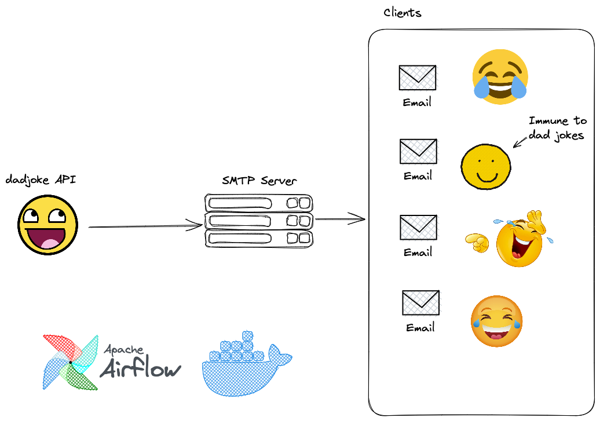

# Dadjoke x Airflow 

Daily dad joke scheduled by airflow to your mailbox!

---

## Motivation
The purpose of this project is to provide users with a daily dose of humor via email. The project leverages Airflow to schedule and send emails, and the Dad Joke API to retrieve random jokes. The project is designed to be flexible and easy to configure, allowing users to specify the email recipients, email subject, and other parameters.





## Installation

To use this project, you will need to set up `airflow` with docker. [Reference here](https://airflow.apache.org/docs/apache-airflow/stable/howto/docker-compose/index.html).

If you follow along the airflow-docker installation, you will have a [docker-compose.yaml](./docker-compose.yaml) file in your project directory.

Then you need to build the Docker image
```bash
# build the image
docker image build . --tag extending_airflow:latest
```

Next step is to modify the `docker-compose.yaml` file to use your own image.

```bash
# before
image: ${AIRFLOW_IMAGE_NAME:-apache/airflow:2.6.1}

# modify it to 
image: ${AIRFLOW_IMAGE_NAME:-extending_airflow:latest}
```

After you set it all up, run the following commands
```bash
# set up metastore database for airflow (defaults to Postgres)
docker compose up airflow-init

# run the server in detached mode
docker compose up -d
```


> Note: it's good practice to use `host.docker.internal` instead of your machine's internal ip address. 


## Usage

After configuring the DAG, you could open up your favorite browser and type

```bash
# open airflow webserver with GUI
localhost:8080
```

You should see a dag called `dad_joke_v_production` and the source code is [daily_dad_joke.py](./dags/daily_dad_joke.py). Have fun!

This will trigger the DAG and send out the daily email on.

## Contributing

Contributions to this project are welcome and encouraged. If you encounter any issues or have suggestions for improvement, please create an issue or submit a pull request.

## License

This project is licensed under the [MIT License](https://opensource.org/licenses/MIT).
